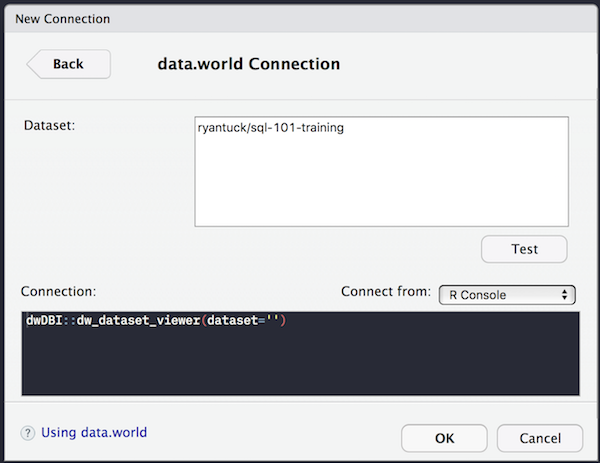
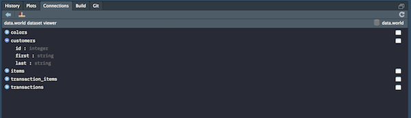
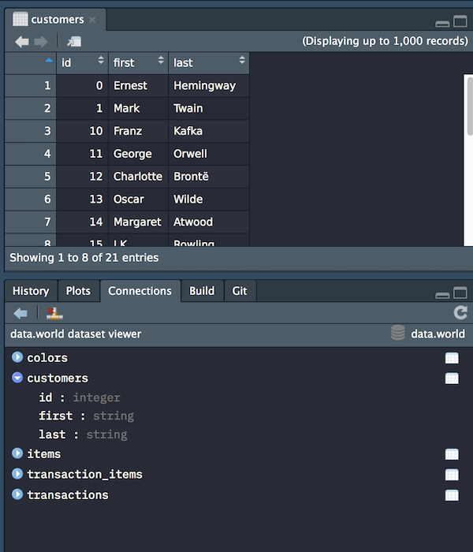

```{r setup, include = FALSE}
knitr::opts_chunk$set(
  collapse = TRUE,
  comment = "#>"
)
```

The `dwDBI` package provides:

1. A light [DBI](http://db.rstudio.com/dbi/) wrapper
around the [data.world API package](https://cran.r-project.org/web/packages/data.world/index.html). The benefit of this is that you can write SQL queries in RMarkdown chunks and evaluate them.
2. Contracts that let you browse data.world datasets with the RStudio Connections panel.

# Querying data.world dataset in RMarkdown Notebooks

First import the package.

```{r}
library('dwDBI')
```

Make sure that you've configured your data.world API key.

```{r, eval=FALSE}
dwapi::configure('YOUR API KEY HERE')
```

```{r include=FALSE}
dwapi::configure(Sys.getenv('DATA_DOT_WORLD_API_KEY'))
```

To run a SQL query, connect to a data.world dataset with the `dw_connect()`
function.

```{r}
sql101_conn <- dw_connect('ryantuck/sql-101-training')
```

In RStudio, you can write and run SQL code chunks by specifying a connection.

```
# ```{sql, connection=sql101_conn}
#     ... your query here ...
#```
```

Running the SQL code chunk returns a data frame.

```{sql, connection=sql101_conn}
select *
from customers
order by `last`
```

# Viewing data.world datasets in RStudio Connections

Again, you'll need to configure your API key.

To open a dataset in the Connections viewer:

1. Go to the Connections tab
2. Click the New Connection icon
3. Choose the data.world connection
4. Enter the name of the dataset you want to view.








